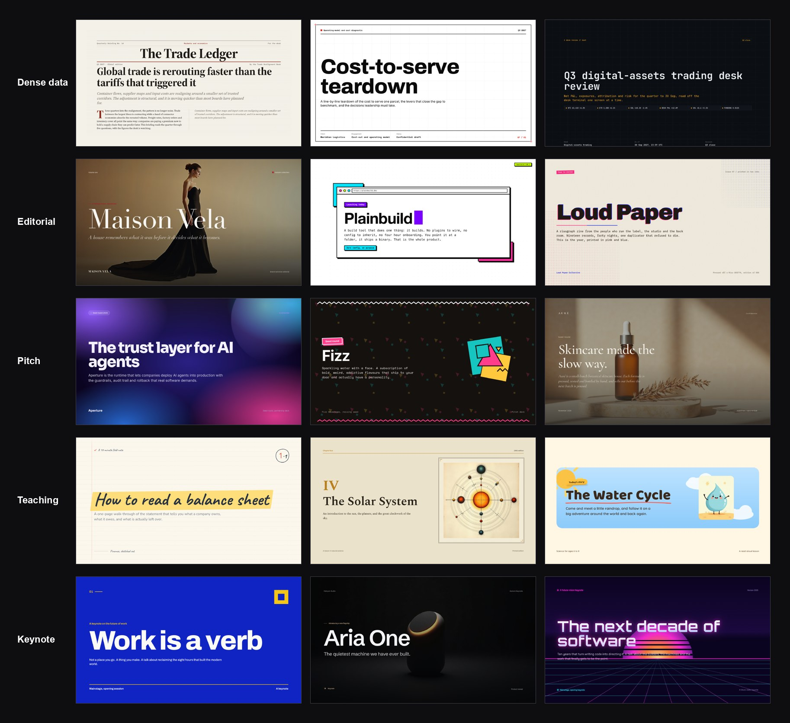

# slide-design-skill

**An AI presentation engine that designs the deck for you.** Describe what your
presentation is about and how it should look — in a few words, a reference site, a brand
URL, or a moodboard — and it derives a bespoke visual style, plans the slides, and renders
a polished, on-brand deck. There is no theme menu and no template to choose from:
**style is discovered, not chosen.**

Built by [SlideSpeak](https://slidespeak.co) to generate presentations, slide decks, pitch
decks, keynotes, and data-heavy reports as clean 1920×1080 HTML — with real charts, tables,
and AI or stock imagery.



*Every deck above came out of the same engine — different topic, different look, each style
generated from its brief. Nothing was picked from a menu.*

## Use it as an agent skill

This repo is an [agent skill](https://skills.sh). Add it to your coding agent — Claude Code,
Cursor, Copilot, and others — in one command:

```bash
npx skills add SlideSpeak/slide-design-skill
```

Then ask your agent to design a presentation. It uses this engine to derive a style from
your brief, plan the deck, and render it — for pitch decks, sales and strategy decks,
keynotes, training and teaching decks, data and report decks, or just "make me some slides."

## How a deck gets made

```
brief ("topic + content + the look in any form")
  └─ resolveStyleInput()        style intake: free text, "like X", "A meets B", brand URL
       ├─ generateSkill()       default path: a bespoke style, generated per brief
       └─ loadSkill()           direct path: a reference seed, when named literally
  └─ planDeck()                 reads the brief: presentation type, audience, register,
                                density rhythm, variance posture
  └─ composeSystemPrompt()      style + plan + content contract -> system prompt
  └─ LLM (host-provided)        returns a slide tree: type + slot values per slide
  └─ validateSlideTree()        schema, composition variety, content lint, fidelity flags
  └─ image subsystem            FAL (AI) + Unsplash/Pexels (stock), brand guard, treatments
  └─ renderSlide()              fills the style's slide templates, resolves directives
                                (charts, icons, tables, scrims, placeholders)
```

Consistency comes from the split: the style (templates, tokens, chrome) is generated once
and frozen; the deck LLM only fills slots. Variety comes from the generator, which produces
distinct compositional primitives per style, and from the planner, which varies density and
composition inside a deck.

## Quality gates

Design rules here are enforced by code, not by prompt wording alone. Prompts carry the
rules; gates make them stick.

| Gate | Catches | Where |
|---|---|---|
| Style validation | format errors, grammar/template drift, uppercase typography, type below 14px, card-edge accent lines, em-dashes, missing graphic system, composition-family monotony | `npm run validate` |
| Slide-tree validation | malformed LLM output, composition monotony per deck, boxed-texture overuse | `validateSlideTree`, runs inside `generateDeck` |
| Content lint | AI-phrase filler, fake precise numbers, topic-label headlines, uniform bullets, eyebrow overuse | part of slide-tree validation |
| Occupancy | slides with large empty bands, hollow card interiors, sparse oversized cells | `npm run measure:occupancy <rendered.html>` |
| Brand guard | logos, trademarks, brand names in image prompts and stock queries; model-invented figures flagged | engine level, cannot be bypassed |
| FAL spend guard | unbounded AI-image cost; caches images so a re-render is not re-billed | engine level (`SLIDESPEAK_MAX_FAL_CALLS`) |
| Security smoke | XSS via slots/URLs, path traversal, malformed trees | `npm run test:security` |

## Folder layout

```
engine/           loader, token compiler, renderer, prompt composer, deck planner,
                  style intake, generator, moodboard intake, image subsystem,
                  brand guard, validators (slide tree, quality lint, occupancy, richness)
skills/           internal reference seeds — they anchor quality and act as few-shot
                  material for the generator. Not a menu users pick from.
meta-generator/   guided checklist + templates for authoring a style by hand
scripts/          render, validate, measure, smoke tests, bake scripts
docs/             SKILL-FORMAT.md, INTEGRATION.md, HANDOVER.md, specs/, plans/
examples/         rendered end-to-end decks
```

## Quick start (development)

```bash
npm install

# all gates: style validation + smoke suites
npm test

# render a deck deterministically (no LLM, no image APIs)
npx tsx scripts/render-fixture.mts opex scripts/opex-deck.json /tmp/opex.html

# check the render for underfilled slides
npm run measure:occupancy /tmp/opex.html
```

Image generation runs over [fal.ai](https://fal.ai) — bring your own API key
(`FAL_KEY`); no key ships in this repo.

Integration into the SlideSpeak pipeline: `docs/INTEGRATION.md`. Style package format:
`docs/SKILL-FORMAT.md`. State of the build and open questions: `docs/HANDOVER.md`.
