# slide-design-skill

**An AI presentation engine that designs the deck for you.** Describe what your
presentation is about and how it should look — in a few words, a reference site, a brand
URL, or a moodboard — and it derives a bespoke visual style, plans the slides, and renders
a polished, on-brand deck. There is no theme menu and no template to choose from:
**style is discovered, not chosen.**

Built by [SlideSpeak](https://slidespeak.co) to generate presentations, slide decks, pitch
decks, keynotes, and data-heavy reports as clean 1920×1080 HTML — with real charts, tables,
and AI or stock imagery.


*Every deck above came out of the same engine — different topic, different look, each style
generated from its brief. Nothing was picked from a menu.*

> **AI images are optional but a highlight.** Set a `FAL_KEY` and it generates consistent,
> on-brand imagery across the whole deck (no key in the repo — bring your own). Without a key
> the skill still runs end to end and renders the deck without AI images.

## Use it as an agent skill

This repo is an [agent skill](https://skills.sh). Add it to your coding agent — Claude Code,
Cursor, Copilot, and others — in one command:

```bash
npx skills add SlideSpeak/slide-design-skill
```

Then ask your agent to design a presentation. It uses this engine to derive a style from
your brief, plan the deck, and render it — for pitch decks, sales and strategy decks,
keynotes, training and teaching decks, data and report decks, or just "make me some slides."

## Examples

A few decks the engine produced — each a different brief, each its own generated style.
Nothing chosen from a menu.

<table>
<tr>
<td align="center" width="25%"><a href="assets/examples/chromafield.jpg">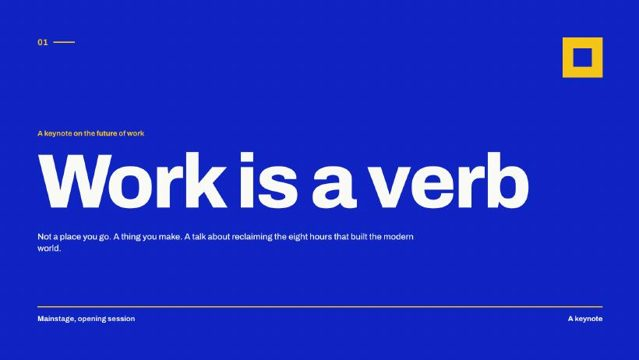</a><br><b>Work is a verb</b><br><sub>Keynote · bold type</sub></td>
<td align="center" width="25%"><a href="assets/examples/couture.jpg"></a><br><b>Maison Vela</b><br><sub>Brand · fashion</sub></td>
<td align="center" width="25%"><a href="assets/examples/broadsheet.jpg">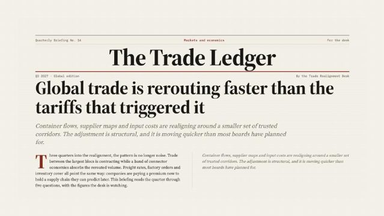</a><br><b>The Trade Ledger</b><br><sub>Data report</sub></td>
<td align="center" width="25%"><a href="assets/examples/memphis.jpg">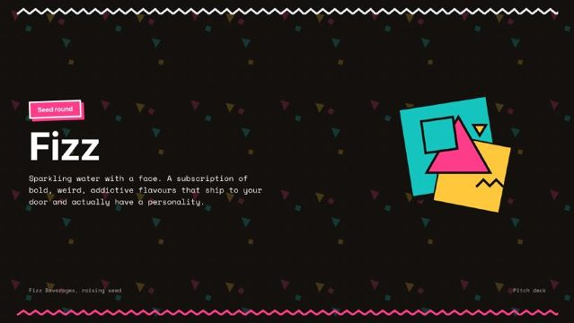</a><br><b>Fizz</b><br><sub>Brand · memphis</sub></td>
</tr>
<tr>
<td align="center" width="25%"><a href="assets/examples/synthwave.jpg">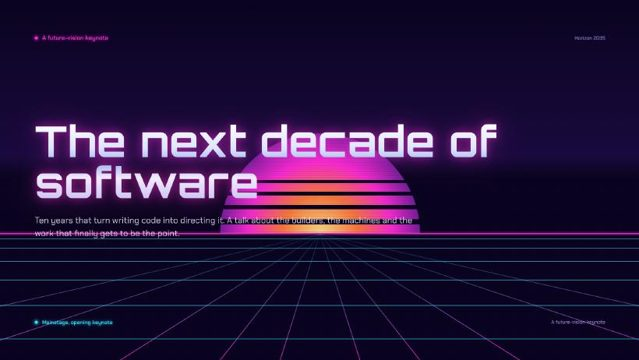</a><br><b>The next decade of software</b><br><sub>Keynote · neon</sub></td>
<td align="center" width="25%"><a href="assets/examples/fieldnote.jpg">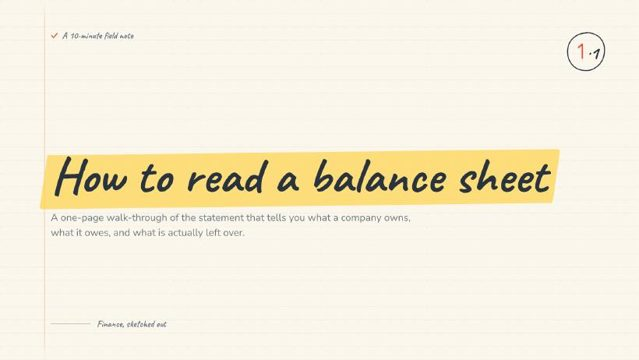</a><br><b>Read a balance sheet</b><br><sub>Teaching</sub></td>
<td align="center" width="25%"><a href="assets/examples/hypergradient.jpg">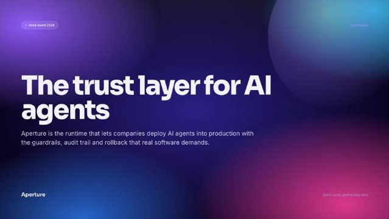</a><br><b>The trust layer for AI</b><br><sub>Investor pitch</sub></td>
<td align="center" width="25%"><a href="assets/examples/gridform.jpg">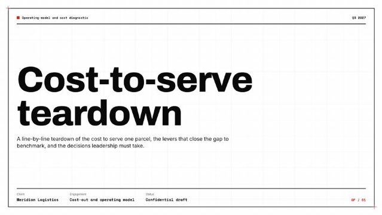</a><br><b>Cost-to-serve teardown</b><br><sub>Strategy</sub></td>
</tr>
<tr>
<td align="center" width="25%"><a href="assets/examples/risoclub.jpg">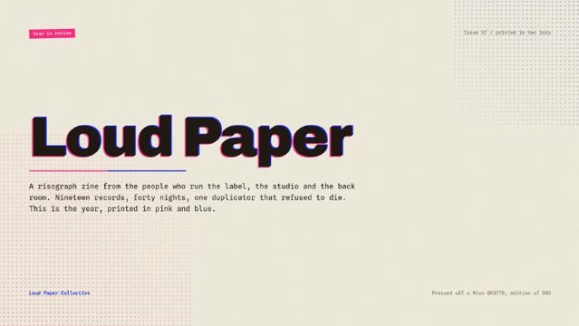</a><br><b>Loud Paper</b><br><sub>Editorial · risograph</sub></td>
<td align="center" width="25%"><a href="assets/examples/obscura.jpg">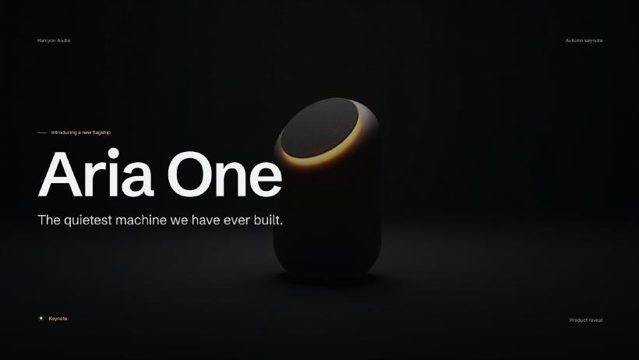</a><br><b>Aria One</b><br><sub>Product · dark</sub></td>
<td align="center" width="25%"><a href="assets/examples/storytime.jpg">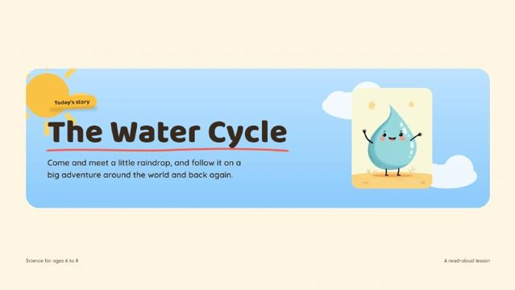</a><br><b>The Water Cycle</b><br><sub>Teaching · illustrated</sub></td>
<td align="center" width="25%"><a href="assets/examples/anvil.jpg">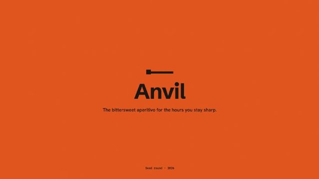</a><br><b>Anvil</b><br><sub>Investor pitch</sub></td>
</tr>
<tr>
<td align="center" width="25%"><a href="assets/examples/regal.jpg">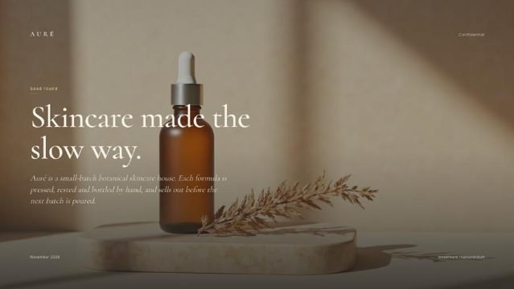</a><br><b>Skincare, the slow way</b><br><sub>Product</sub></td>
<td align="center" width="25%"><a href="assets/examples/tickertape.jpg">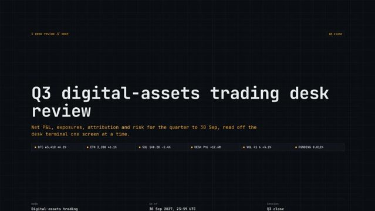</a><br><b>Trading desk review</b><br><sub>Data · dark</sub></td>
<td align="center" width="25%"><a href="assets/examples/schoolbook.jpg"></a><br><b>The Solar System</b><br><sub>Teaching</sub></td>
<td align="center" width="25%"><a href="assets/examples/address.jpg">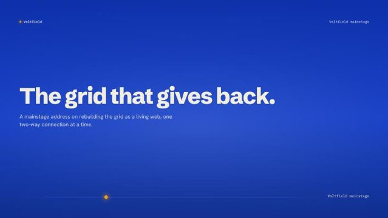</a><br><b>The grid that gives back</b><br><sub>Pitch · energy</sub></td>
</tr>
<tr>
<td align="center" width="25%"><a href="assets/examples/rawstack.jpg">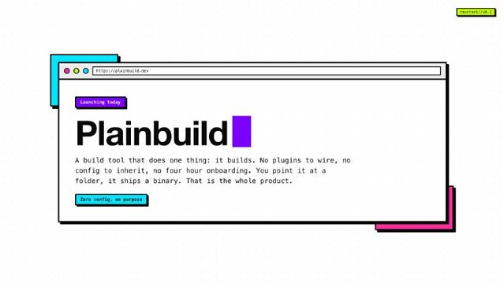</a><br><b>Plainbuild</b><br><sub>Product · playful</sub></td>
<td align="center" width="25%"><a href="assets/examples/meander.jpg">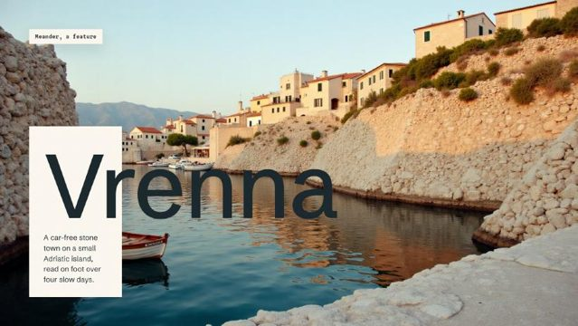</a><br><b>We replant the coast</b><br><sub>Brand · nature</sub></td>
<td align="center" width="25%"><a href="assets/examples/pylon.jpg">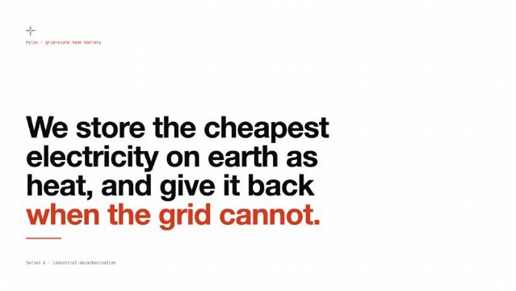</a><br><b>The machines that build</b><br><sub>Keynote · industrial</sub></td>
<td align="center" width="25%"><a href="assets/examples/vela.jpg"></a><br><b>A living shoreline</b><br><sub>Report · photographic</sub></td>
</tr>
<tr>
<td align="center" width="25%"><a href="assets/examples/kelvin.jpg">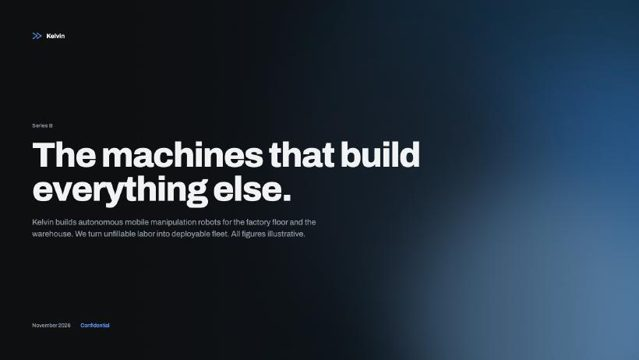</a><br><b>Energy stored as heat</b><br><sub>Pitch · climate</sub></td>
<td align="center" width="25%"><a href="assets/examples/vision.jpg">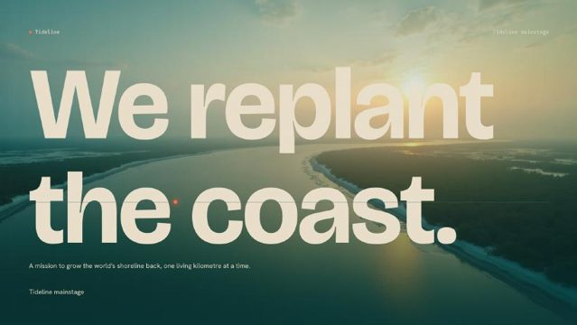</a><br><b>Strategy review</b><br><sub>Clean · data</sub></td>
<td align="center" width="25%"><a href="assets/examples/story.jpg"></a><br><b>Patient craft</b><br><sub>Editorial · photographic</sub></td>
<td align="center" width="25%"><a href="assets/examples/workshop.jpg">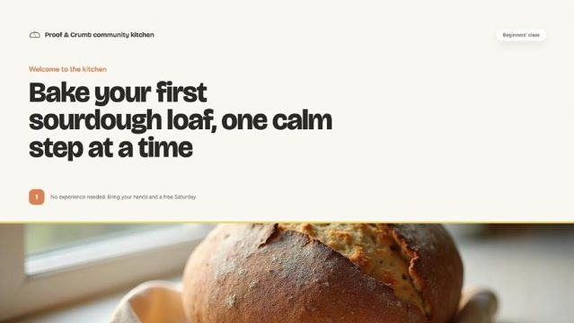</a><br><b>Hands-on training</b><br><sub>Teaching</sub></td>
</tr>
</table>

The full rendered HTML for a few of these lives in [`examples/`](examples/) — real charts,
tables and type, all hand-coded HTML (no images needed). Open one locally, or preview in the
browser:
[pitch](https://htmlpreview.github.io/?https://github.com/SlideSpeak/slide-design-skill/blob/main/examples/ai-trust-layer-pitch.html) ·
[keynote](https://htmlpreview.github.io/?https://github.com/SlideSpeak/slide-design-skill/blob/main/examples/work-is-a-verb-keynote.html) ·
[report](https://htmlpreview.github.io/?https://github.com/SlideSpeak/slide-design-skill/blob/main/examples/trade-ledger-report.html) ·
[teaching](https://htmlpreview.github.io/?https://github.com/SlideSpeak/slide-design-skill/blob/main/examples/balance-sheet-explainer.html) ·
[consulting](https://htmlpreview.github.io/?https://github.com/SlideSpeak/slide-design-skill/blob/main/examples/cost-to-serve-teardown.html)

## How a deck gets made

```
brief ("topic + content + the look in any form")
  └─ resolveStyleInput()        style intake: free text, "like X", "A meets B", brand URL
       ├─ generateSkill()       default path: a bespoke style, generated per brief
       └─ loadSkill()           direct path: a reference seed, when named literally
  └─ planDeck()                 reads the brief: presentation type, audience, register,
                                density rhythm, variance posture
  └─ composeSystemPrompt()      style + plan + content contract -> system prompt
  └─ LLM (host-provided)        returns a slide tree: type + slot values per slide
  └─ validateSlideTree()        schema, composition variety, content lint, fidelity flags
  └─ image subsystem            FAL (AI) + Unsplash/Pexels (stock), brand guard, treatments
  └─ renderSlide()              fills the style's slide templates, resolves directives
                                (charts, icons, tables, scrims, placeholders)
```

Consistency comes from the split: the style (templates, tokens, chrome) is generated once
and frozen; the deck LLM only fills slots. Variety comes from the generator, which produces
distinct compositional primitives per style, and from the planner, which varies density and
composition inside a deck.

## Quality gates

Design rules here are enforced by code, not by prompt wording alone. Prompts carry the
rules; gates make them stick.

| Gate | Catches | Where |
|---|---|---|
| Style validation | format errors, grammar/template drift, uppercase typography, type below 14px, card-edge accent lines, em-dashes, missing graphic system, composition-family monotony | `npm run validate` |
| Slide-tree validation | malformed LLM output, composition monotony per deck, boxed-texture overuse | `validateSlideTree`, runs inside `generateDeck` |
| Content lint | AI-phrase filler, fake precise numbers, topic-label headlines, uniform bullets, eyebrow overuse | part of slide-tree validation |
| Occupancy | slides with large empty bands, hollow card interiors, sparse oversized cells | `npm run measure:occupancy <rendered.html>` |
| Brand guard | logos, trademarks, brand names in image prompts and stock queries; model-invented figures flagged | engine level, cannot be bypassed |
| FAL spend guard | unbounded AI-image cost; caches images so a re-render is not re-billed | engine level (`SLIDESPEAK_MAX_FAL_CALLS`) |
| Security smoke | XSS via slots/URLs, path traversal, malformed trees | `npm run test:security` |

## Folder layout

```
engine/           loader, token compiler, renderer, prompt composer, deck planner,
                  style intake, generator, moodboard intake, image subsystem,
                  brand guard, validators (slide tree, quality lint, occupancy, richness)
skills/           internal reference seeds — they anchor quality and act as few-shot
                  material for the generator. Not a menu users pick from.
meta-generator/   guided checklist + templates for authoring a style by hand
scripts/          render, validate, measure, smoke tests, bake scripts
docs/             SKILL-FORMAT.md, INTEGRATION.md, HANDOVER.md, specs/, plans/
examples/         rendered end-to-end decks
```

## Quick start (development)

```bash
npm install

# all gates: style validation + smoke suites
npm test

# render a deck deterministically (no LLM, no image APIs)
npx tsx scripts/render-fixture.mts opex scripts/opex-deck.json /tmp/opex.html

# check the render for underfilled slides
npm run measure:occupancy /tmp/opex.html
```

Image generation runs over [fal.ai](https://fal.ai) — bring your own API key
(`FAL_KEY`); no key ships in this repo.

Integration into the SlideSpeak pipeline: `docs/INTEGRATION.md`. Style package format:
`docs/SKILL-FORMAT.md`. State of the build and open questions: `docs/HANDOVER.md`.
